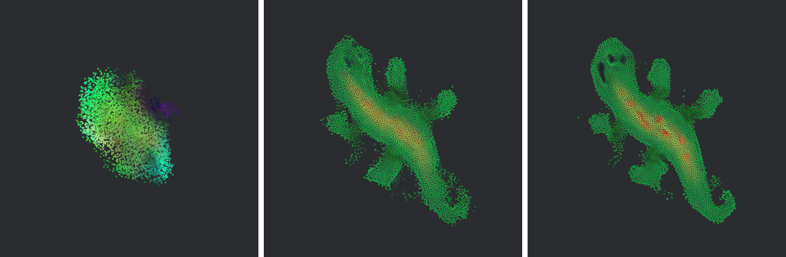

# burn_automata

[](https://github.com/mosure/burn_automata/actions/workflows/test.yml)
[](https://github.com/mosure/burn_automata/actions/workflows/clippy.yml)
[](https://github.com/mosure/burn_automata/actions/workflows/pages.yml)
[](LICENSE)

Burn-native Neural Particle Automata inference and training with optimized 2D
GPU kernels and a native/web Bevy Gaussian Splatting viewer. Try the
[live WebGPU demo](https://mosure.github.io/burn_automata/).



## features

- [x] upstream NPA checkpoint import and strict CPU/WGPU parity validation
- [x] device-resident WGPU hashgrid, perception, rollout, and Gaussian decoding
- [x] Burn/WGPU and Burn/CUDA Target2D training infrastructure
- [x] DINO spatial-token conditioned HyperNPA training and inference
- [x] fixed and adaptive image-target training from the Bevy viewer
- [x] native and WebGPU viewer with an isolated browser training worker
- [x] headless PNG rollout capture for paper and benchmark automation
- [x] versioned `.bpk` models with checksums and timed training checkpoints
- [x] verified TOML smoke, quality, and throughput configurations
- [ ] from-scratch Burn 2D oracle quality parity with the official trainer
- [ ] broad held-out HyperNPA quality parity with per-image oracle NPAs
- [ ] adaptive long-horizon quality parity with the fixed 2D path
- [ ] quality-scale 3D training and generalization

The hardened fixed 2D inference path and imported upstream catalog are the
reference baseline. Local oracle training, generalized HyperNPA, adaptive NPA,
and 3D training remain research paths until their checked-in parity gates pass.

## viewer

Run the native viewer:

```bash
cargo run --release -p bevy_automata
```

Load a specific fixed or adaptive model:

```bash
cargo run --release -p bevy_automata -- view \
  --model path/to/model.bpk \
  --particles 4096

cargo run --release -p bevy_automata -- view \
  --adaptive-model path/to/adaptive_model.bpk
```

The image workflow is:

1. `open image` selects the target.
2. `infer` runs DINO -> conditioned HyperNPA -> NPA generation.
3. `train fresh` starts fixed or adaptive Target2D training.
4. `stop` ends training after the current optimizer step.

Training runs independently from the displayed rollout. Live model snapshots
update the viewer without reseeding it, while `reset` only resets the visible
rollout. The reset-period and learning-rate controls are configurable in the
training panel.

## headless export

Render selected rollout steps to PNG without opening the interactive viewer:

```bash
cargo run --release -p bevy_automata -- export \
  --model path/to/model.bpk \
  --particles 4096 \
  --steps 512 \
  --capture-steps 32,96,256,512 \
  --output-dir target/lizard_rollout
```

Use `--hyper-image`, `--hyper-base`, `--hyper-model`, and `--dino-model` for
image-conditioned exports. Adaptive exports accept `--adaptive-model`.

## inference

Run the core WGPU inference path and export the final rollout state:

```bash
cargo run --release -p burn_automata --features gpu_wgpu -- \
  infer \
  --gpu \
  --model path/to/model.bpk \
  --particles 4096 \
  --steps 128 \
  --output target/rollout.json
```

Profile the resident GPU path:

```bash
cargo run --release -p burn_automata --features gpu_wgpu -- \
  bench \
  --preset growing-2d \
  --particles 4096 \
  --steps 128 \
  --gpu \
  --neighbor-mode auto
```

## hypernpa

The maintained image-conditioned path is trained end to end:

```text
image
  -> DINO ViT-S spatial tokens
  -> conditioned rectified row flow
  -> shared NPA + generated controller residual
  -> particle rollout
  -> Target2D image and dynamics loss
```

Run the bounded WGPU smoke after provisioning the model and target paths named
by the config:

```bash
cargo run --release -p burn_automata \
  --no-default-features \
  --features cli,backend_ndarray,backend_wgpu,dino -- \
  train-hypernpa2d \
  --config configs/verified/2d/hyper_e2e/smoke_conditional_row_flow.toml
```

Reproducible configs belong under `configs/verified/`; local experiments belong
under the gitignored `configs/sandbox/`. The CUDA quality configuration is
`configs/verified/2d/hyper_e2e/production_omnisvg_1k_conditional_row_flow_e2e_cuda.toml`.

## web

The deployed viewer supports the same image dialog, HyperNPA inference, fixed
training, and adaptive training controls as native. Browser optimization runs
in a dedicated Web Worker so training does not block the Bevy render loop.

Build the viewer and worker:

```bash
scripts/build_wasm.sh
python3 -m http.server 4173 --directory www
```

Run the real browser WebGPU gate:

```bash
WEB_BASE_URL=http://127.0.0.1:4173/ \
  node scripts/validate_web_runtime.mjs --all
```

See [the web deployment notes](www/README.md) for model packaging, checksums,
GitHub Pages, and GPU-less CI validation.

## crates

| crate | purpose |
| --- | --- |
| `burn_automata_kernels` | CubeCL/WGPU/CUDA and CPU NPA kernels |
| `burn_automata` | models, inference, training, import, validation, and CLI |
| `bevy_automata` | native/web viewer, headless renderer, and GPU interop |
| `burn_automata_web_worker` | isolated browser Target2D training worker |
| `vendor/bevy_burn` | local Burn-to-Bevy buffer bridge |

## compatibility

| burn_automata | Burn | Bevy | Rust |
| --- | --- | --- | --- |
| `0.1` | `0.21` | `0.19` | `1.95` |

The default native core enables NdArray and WGPU backends. CUDA training uses
`--no-default-features --features cli,backend_ndarray,backend_cuda,dino`.

## docs

- [NPA reference and parity contract](docs/npa_reference.md)
- [HyperNPA paper](docs/hyper_npa.pdf)
- [HyperNPA quality status](docs/hypernpa_dino_flow_quality_status.md)
- [budgeted adaptive NPA](docs/budgeted_adaptive_npa.md)
- [continuous-scale adaptive NPA](docs/adaptive_continuous_scale.md)
- [kernel strategy](docs/kernel_strategy.md)
- [GPU interop](docs/gpu_interop.md)
- [validation](docs/validation.md)

## validation

```bash
cargo fmt --all -- --check
cargo test --workspace --lib
cargo clippy --workspace --all-targets -- -D warnings
scripts/check_inference_features.sh
scripts/build_wasm.sh
```

Hardware-specific WGPU/CUDA benchmarks and the browser runtime gate are kept
separate from CPU-only CI checks.

## license

Licensed under the [MIT License](LICENSE).

## references

- [Self-Organising Neural Particle Automata](https://selforg-npa.github.io/)
- [Burn](https://burn.dev/)
- [Bevy](https://bevy.org/)
- [bevy_gaussian_splatting](https://github.com/mosure/bevy_gaussian_splatting)
