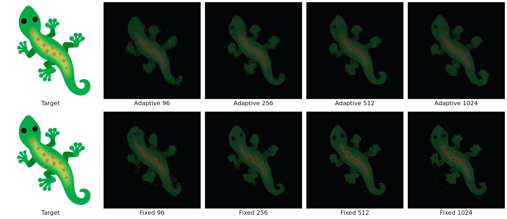
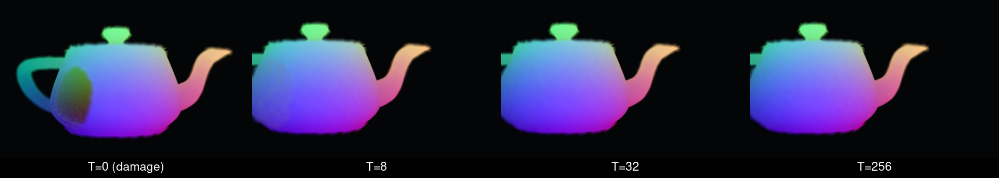
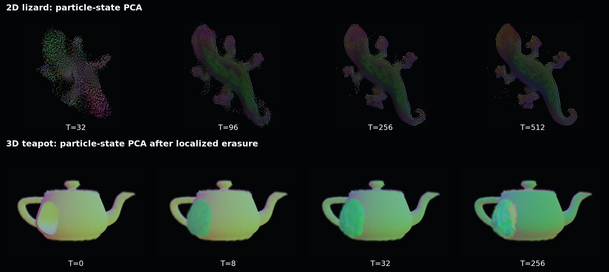

# burn_automata

[](https://github.com/mosure/burn_automata/actions/workflows/test.yml)
[](https://github.com/mosure/burn_automata/actions/workflows/clippy.yml)
[](https://github.com/mosure/burn_automata/actions/workflows/pages.yml)
[](LICENSE)

Burn-native Neural Particle Automata inference and training with optimized 2D
GPU kernels and a native/web Bevy Gaussian Splatting viewer. Try the
[live WebGPU demo](https://mosure.github.io/burn_automata/).







The PCA view projects all recurrent particle-state channels onto a rolling
three-component basis and maps those coordinates to RGB. The top row shows
the released 4,096-particle 2D lizard; the bottom row shows the
16,384-particle mesh-conditioned 3D teapot after localized state erasure.
These colors expose state organization and recovery rather than decoded
material color.

## features

- [x] upstream NPA checkpoint import and strict CPU/WGPU parity validation
- [x] device-resident WGPU hashgrid, perception, rollout, and Gaussian decoding
- [x] Burn/WGPU and Burn/CUDA Target2D training infrastructure
- [x] DINO spatial-token conditioned HyperNPA training and inference
- [x] GPU-resident rolling particle-state PCA visualization
- [x] fixed and adaptive image-target training from the Bevy viewer
- [x] native and WebGPU viewer with an isolated browser training worker
- [x] headless PNG rollout capture for paper and benchmark automation
- [x] normalized OBJ import, Burn/WGPU mesh-conditioned 3D training, oriented
      3D Gaussian inference, and PanOrbit inspection
- [x] versioned `.bpk` models with checksums and timed training checkpoints
- [x] verified TOML smoke, quality, and throughput configurations
- [ ] from-scratch Burn 2D oracle quality parity with the official trainer
- [ ] broad held-out HyperNPA quality parity with per-image oracle NPAs
- [ ] adaptive long-horizon quality parity with the fixed 2D path
- [ ] neutral-seed 3D morphogenesis and multi-object 3D generalization

The hardened fixed 2D inference path and imported upstream catalog are the
reference baseline. Local 2D oracle training, generalized HyperNPA, adaptive
NPA, and neutral-seed 3D morphogenesis remain research paths until their
checked-in parity gates pass. The separate mesh-conditioned 3D path has a
passing teapot quality gate.

## viewer

Run the native viewer:

```bash
cargo run --release -p bevy_automata
```

Load a specific fixed or adaptive model:

```bash
cargo run --release -p bevy_automata -- view \
  --model path/to/model.bpk \
  --particles 4096

cargo run --release -p bevy_automata -- view \
  --adaptive-model path/to/adaptive_model.bpk
```

Enable `particle state PCA` in the view panel, or pass `view --pca`, to map the
three leading state components to RGB. Projection runs every rendered frame;
the rolling basis is updated periodically without GPU readback.

The image workflow is:

1. `open image` selects the target.
2. `infer` runs DINO -> conditioned HyperNPA -> NPA generation.
3. `train fresh` starts fixed or adaptive Target2D training.
4. `stop` ends training after the current optimizer step.

Training runs independently from the displayed rollout. Live model snapshots
update the viewer without reseeding it, while `reset` only resets the visible
rollout. The reset-period and learning-rate controls are configurable in the
training panel.

The native 3D workflow is:

1. `open mesh` selects a Wavefront OBJ and isotropically normalizes its longest
   axis to the viewer domain.
2. The normalized 16,384-particle surface preview switches the renderer to
   oriented 3D Gaussians and enables the PanOrbit camera.
3. `train 3d` runs the canonical Burn/WGPU mesh-state trainer on a background
   thread and publishes bounded live model snapshots.
4. The completed model is reloaded with its embedded surface initialization;
   orbit, pan, zoom, reset, PCA color, and rollout controls remain available.

Train and validate the canonical Utah teapot from the CLI:

```bash
cargo run --release -p burn_automata --features gpu_wgpu -- \
  train-mesh3d \
  --config configs/verified/3d/mesh/teapot_quality.toml

cargo run --release -p burn_automata --features gpu_wgpu -- \
  evaluate-mesh3d \
  --config configs/verified/3d/mesh/teapot_quality.toml \
  --model artifacts/mesh3d/utah_teapot/model.bpk \
  --report artifacts/mesh3d/utah_teapot/evaluation.json

cargo run --release -p bevy_automata -- view \
  --model artifacts/mesh3d/utah_teapot/model.bpk \
  --preset growing3d-gs \
  --particles 16384
```

The verified teapot run trains 16.38M rows in 9.01s (`1.82M rows/s`) and
passes three-seed 16,384-particle checks through 256 steps: density PSNR
`25.91-26.29 dB`, color PSNR `43.04-43.41 dB`, depth PSNR
`41.17-41.82 dB`, `100%` target coverage, and `52.48 dB` worst localized
color recovery at step 32. This is a mesh-conditioned fixed surface-support
NPA with recurrent state repair. It is not evidence of target-independent
growth from a compact neutral seed; see [3D status](docs/research/3d_status.md).

## headless export

Render selected rollout steps to PNG without opening the interactive viewer:

```bash
cargo run --release -p bevy_automata -- export \
  --model path/to/model.bpk \
  --particles 4096 \
  --steps 512 \
  --capture-steps 32,96,256,512 \
  --output-dir target/lizard_rollout
```

Add `--pca` to export the same rollout with GPU-resident particle-state PCA
colors. PCA fitting, projection, display normalization, and Gaussian-buffer
writes remain on the GPU; only the requested screenshots are read back.

Use `--hyper-image`, `--hyper-base`, `--hyper-model`, and `--dino-model` for
image-conditioned exports. Adaptive exports accept `--adaptive-model`.

## inference

Run the core WGPU inference path and export the final rollout state:

```bash
cargo run --release -p burn_automata --features gpu_wgpu -- \
  infer \
  --gpu \
  --model path/to/model.bpk \
  --particles 4096 \
  --steps 128 \
  --output target/rollout.json
```

Profile the resident GPU path:

```bash
cargo run --release -p burn_automata --features gpu_wgpu -- \
  bench \
  --preset growing-2d \
  --particles 4096 \
  --steps 128 \
  --gpu \
  --neighbor-mode auto
```

## hypernpa

The maintained image-conditioned path is trained end to end:

```text
image
  -> DINO ViT-S spatial tokens
  -> conditioned rectified row flow
  -> shared NPA + generated controller residual
  -> particle rollout
  -> Target2D image and dynamics loss
```

Run the bounded WGPU smoke after provisioning the model and target paths named
by the config:

```bash
cargo run --release -p burn_automata \
  --no-default-features \
  --features cli,backend_ndarray,backend_wgpu,dino -- \
  train-hypernpa2d \
  --config configs/verified/2d/hypernpa/flow/smoke_conditional_row_flow.toml
```

Reproducible configs belong under `configs/verified/`; local experiments belong
under the gitignored `configs/sandbox/`. The CUDA quality configuration is
`configs/verified/2d/hypernpa/e2e/production_omnisvg_1k_conditional_row_flow_e2e_cuda.toml`.

## web

The deployed viewer supports the same image dialog, HyperNPA inference, fixed
training, and adaptive training controls as native. Browser optimization runs
in a dedicated Web Worker so training does not block the Bevy render loop.
It also imports and normalizes browser-local OBJ meshes for oriented-Gaussian
preview and PanOrbit inspection. Mesh-target training is currently native-only
until the synchronous WGPU evaluator is moved into the browser worker.

Build the viewer and worker:

```bash
scripts/web/build_wasm.sh
python3 -m http.server 4173 --directory www
```

Run the real browser WebGPU gate:

```bash
WEB_BASE_URL=http://127.0.0.1:4173/ \
  node scripts/web/validate_web_runtime.mjs --all
```

See [the web deployment notes](www/README.md) for model packaging, checksums,
GitHub Pages, and GPU-less CI validation.

## crates

| crate | purpose |
| --- | --- |
| `burn_automata_kernels` | CubeCL/WGPU/CUDA and CPU NPA kernels |
| `burn_automata` | models, inference, training, import, validation, and CLI |
| `bevy_automata` | native/web viewer, headless renderer, and GPU interop |
| `burn_automata_web_worker` | isolated browser Target2D training worker |
| `vendor/bevy_burn` | local Burn-to-Bevy buffer bridge |

## compatibility

| burn_automata | Burn | Bevy | Rust |
| --- | --- | --- | --- |
| `0.1` | `0.21` | `0.19` | `1.95` |

The default native core enables NdArray and WGPU backends. CUDA training uses
`--no-default-features --features cli,backend_ndarray,backend_cuda,dino`.

## docs

- [documentation index](docs/README.md)
- [NPA reference and parity contract](docs/architecture/npa_reference.md)
- [HyperNPA paper and companion](docs/papers/hypernpa/)
- [HyperNPA quality status](docs/research/hypernpa_status.md)
- [budgeted adaptive NPA paper and companion](docs/papers/adaptive/)
- [continuous-scale adaptive NPA status](docs/research/adaptive_continuous_scale.md)
- [kernel strategy](docs/architecture/kernel_strategy.md)
- [GPU interop](docs/architecture/gpu_interop.md)
- [validation](docs/development/validation.md)

## validation

```bash
cargo fmt --all -- --check
cargo test --workspace --lib
cargo clippy --workspace --all-targets -- -D warnings
scripts/ci/check_repository_layout.sh
scripts/ci/check_inference_features.sh
scripts/web/build_wasm.sh
```

Hardware-specific WGPU/CUDA benchmarks and the browser runtime gate are kept
separate from CPU-only CI checks.

## citation

To cite this repository and its maintained implementation:

```bibtex
@software{mosure2026burnautomata,
  author = {Mitchell Mosure},
  title = {burn\_automata: Burn-Native Neural Particle Automata},
  year = {2026},
  version = {0.1.0},
  url = {https://github.com/mosure/burn_automata}
}
```

GitHub also exposes this metadata through [`CITATION.cff`](CITATION.cff). The
adaptive and HyperNPA manuscripts have paper-specific citations in their
respective PDFs and BibTeX sources.

## license

Licensed under the [MIT License](LICENSE).

## references

- [Self-Organising Neural Particle Automata](https://selforg-npa.github.io/)
- [Burn](https://burn.dev/)
- [Bevy](https://bevy.org/)
- [bevy_gaussian_splatting](https://github.com/mosure/bevy_gaussian_splatting)
